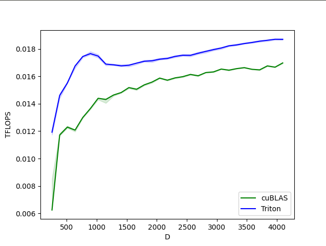

## Transformer in Triton (wip)

Implementation of a Transformer, but completely in <a href="https://triton-lang.org/">Triton</a>. I'm completely new to lower-level neural net code, so this repository will mostly be a learning experience, with the end-goal being a vanilla transformer that is faster and more efficient to train.

- [x] softmax
- [x] cross-entropy (using triton ops)
- [x] layernorm forward
- [x] layernorm backwards
- [x] batch matrix multiply + fused act forwards
- [x] optimize layernorm backwards (figure out how much to store vs recompute)
- [ ] use memory efficient dropout from Triton tutorials
- [ ] batch matrix multiply + fused act backwards
- [ ] fused attention (expand on softmax)
- [ ] use triton matmul for other projections
- [ ] benchmark and optimize
- [ ] kernels conditional on inference vs training

## Results

Layernorm forward

</img>

Layernorm forwards and backwards

</img>

Softmax forwards and backwards

</img>

## Install

```bash
$ pip install triton-transformer
```

## Usage

```python
import torch
from triton_transformer import Transformer

model = Transformer(
    num_tokens = 256,
    max_seq_len = 1024,
    dim = 512,
    depth = 6,
    heads = 8,
    dim_head = 64,
    use_triton = True # use this to turn on / off triton use
)

x = torch.randint(0, 256, (1, 1024))
mask = torch.ones(1, 1024).bool()

logits = model(x, mask = mask) # (1, 1024, 256)
```

## Test - GPT training

```bash
$ python train.py
```

## Citations

```bibtex
@article{Tillet2019TritonAI,
    title   = {Triton: an intermediate language and compiler for tiled neural network computations},
    author  = {Philippe Tillet and H. Kung and D. Cox},
    journal = {Proceedings of the 3rd ACM SIGPLAN International Workshop on Machine Learning and Programming Languages},
    year    = {2019}
}
```

```bibtex
@misc{vaswani2017attention,
    title   = {Attention Is All You Need}, 
    author  = {Ashish Vaswani and Noam Shazeer and Niki Parmar and Jakob Uszkoreit and Llion Jones and Aidan N. Gomez and Lukasz Kaiser and Illia Polosukhin},
    year    = {2017},
    eprint  = {1706.03762},
    archivePrefix = {arXiv},
    primaryClass = {cs.CL}
}
```

```bibtex
@misc{so2021primer,
    title   = {Primer: Searching for Efficient Transformers for Language Modeling},
    author  = {David R. So and Wojciech Mańke and Hanxiao Liu and Zihang Dai and Noam Shazeer and Quoc V. Le},
    year    = {2021},
    eprint  = {2109.08668},
    archivePrefix = {arXiv},
    primaryClass = {cs.LG}
}
```
